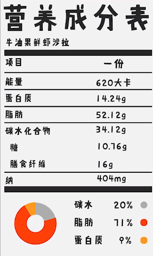
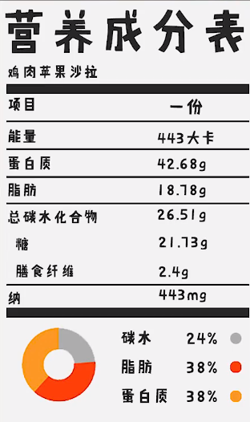
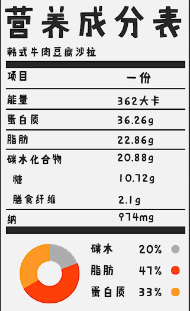
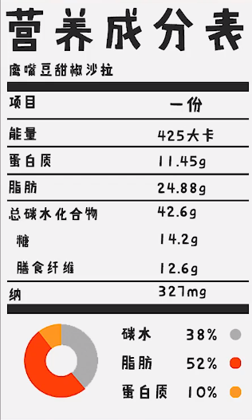
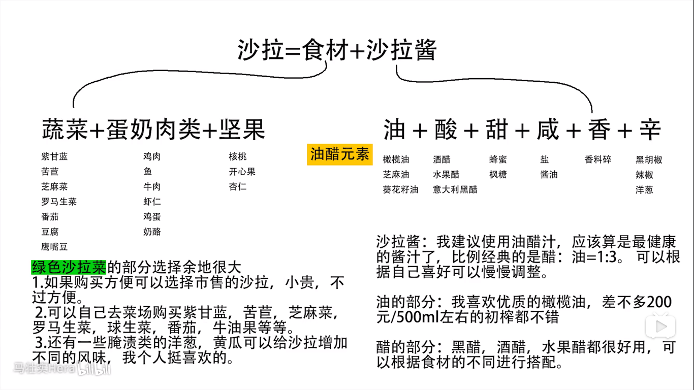

> 牛油果鲜虾沙拉

`柠檬油醋汁`：

* 柠檬汁：30ml（差不多一个）
* 好的橄榄油 ：90ml
  * 蜂蜜：5-10ml
* 盐，黑胡椒

摇晃一会儿产生乳化反应。

`沙拉部分`：

* 牛油果：一个
* 番茄：适量
* 辣椒：一个
* 虾仁：适量

虾仁擦干水分，加橄榄油中火，加盐，黑胡椒炒熟。牛油果番茄切丁，加Tabasco辣酱几滴，加入炒熟的虾仁，油醋汁两到三勺搅拌均匀。

> 鸡肉苹果沙拉

`蜂蜜芥末酱`：

* 第戎芥末酱：1大勺半
* 蜂蜜：1勺
* 橄榄油：2大勺
* 苹果醋：1-2大勺
* 盐，黑胡椒

摇晃一会儿产生乳化反应。

`沙拉部分`：

* 煎好的鸡胸肉：适量
* 苹果：适量
* FETA芝士：可不加
* 绿叶沙拉

苹果切片，FETA芝士切块，没有可以用煎蛋代替。鸡肉切小块，绿叶沙拉、苹果。鸡肉放到盆子里，加入两勺蜂蜜芥末酱，或者加入一些坚果，搅拌均匀。

> 韩式牛肉豆腐沙拉

`韩式辣味酱`：

* 韩式辣酱 ：一大勺
* 生抽：一大勺
* 米醋：一大勺
* 麻油：2大勺
* 蜂蜜：1/2勺
* 芝麻：少许

摇晃一会儿产生乳化反应。

`沙拉部分`：

* 牛肉片少许
* 老豆腐：一块
* 藕片：五六片
* 绿叶沙拉：适量

橄榄油煎老豆腐，中火上色。藕片焯水，不换水焯牛肉。

`装盘`:

绿叶沙拉垫底，放上豆腐藕片肉片，淋两勺韩式辣味酱，放一些芝麻菜作为装饰。

> 鹰嘴豆甜椒沙拉

`黑醋汁`：

* 黑醋：2两大勺
* 橄榄油：6大勺
* 盐，黑胡椒

`沙拉部分`：

* 柠檬：半个

* 红甜椒：1个
* 甜黄椒：1个
* 薄荷：少许
* 水果黄瓜：2根
* 番茄：少许
* 鹰嘴豆：煮好的（可买罐头装）

甜椒去蒂，去籽，切丁。黄瓜，番茄去芯切丁，薄荷叶切碎。混合食材，加入半个柠檬汁，黑醋汁2 - 3勺，盐黑胡椒进行最后调味。

> 总结

